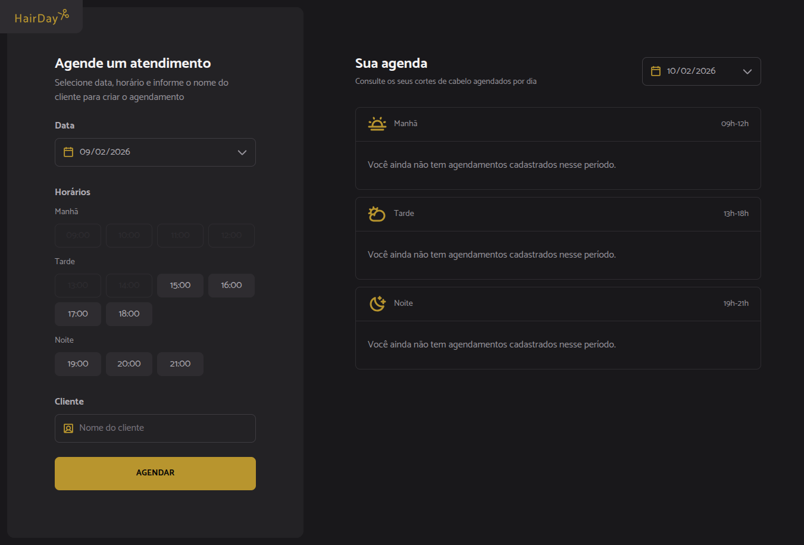

# 💈 HairDay

Uma plataforma web para gerenciamento e agendamento de cortes de cabelo.



> 🚀 Projeto didático desenvolvido durante a formação da Rocketseat (Desafio prático).

---

## 📋 Sobre o projeto

O **HairDay** é uma aplicação web criada com foco educacional, que simula um sistema de agendamento para barbearias ou salões de beleza. A proposta é oferecer uma experiência simples, rápida e eficiente tanto para o administrador quanto para o controle dos horários disponíveis.

---

## ✨ Funcionalidades

* 📅 **Agendamento de horários**
  Selecione datas e horários disponíveis para novos atendimentos.

* 📊 **Visualização da agenda**
  Consulte facilmente todos os agendamentos realizados.

* 📝 **Formulário de agendamento**
  Interface simples para cadastrar o nome do cliente e confirmar o horário.

* 🕘 **Controle de funcionamento**
  Horários disponíveis das **09:00 às 21:00**.

* 💾 **Persistência local**
  Os dados são armazenados no navegador utilizando **localStorage**.

* 📱 **Design responsivo**
  Interface adaptada para desktop e dispositivos móveis.

---

## 🛠️ Tecnologias utilizadas

* **React 19 + TypeScript**
* **Vite**
* **Tailwind CSS**
* **Day.js**
* **SVGR (SVG como componente React)**
* **Hooks customizados para gerenciamento de estado**

---

## 🚀 Como executar o projeto

### 📌 Pré-requisitos

* Node.js (versão 18 ou superior)
* npm ou yarn

### ⚙️ Instalação

1. Clone o repositório:

```bash
git clone https://github.com/FernandoCyber3/HairDay
cd HairDay
```

2. Instale as dependências:

```bash
npm install
```

3. Execute o projeto:

```bash
npm run dev
```

---

## 👨‍💻 Autor

Desenvolvido por:
👉 https://github.com/FernandoAz09

---

## 📚 Observações

Este projeto tem fins exclusivamente **didáticos**, sendo parte dos estudos na formação da **Rocketseat**, com foco em práticas modernas de desenvolvimento frontend utilizando React e ferramentas do ecossistema atual.
